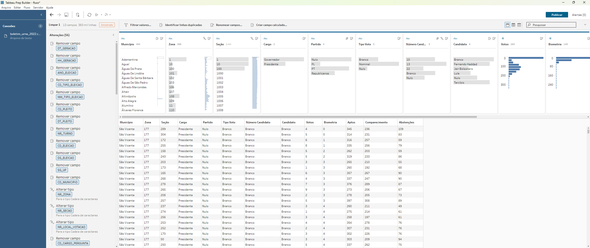
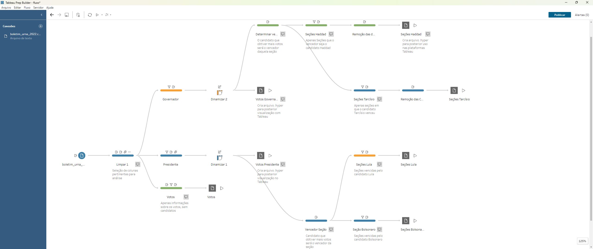
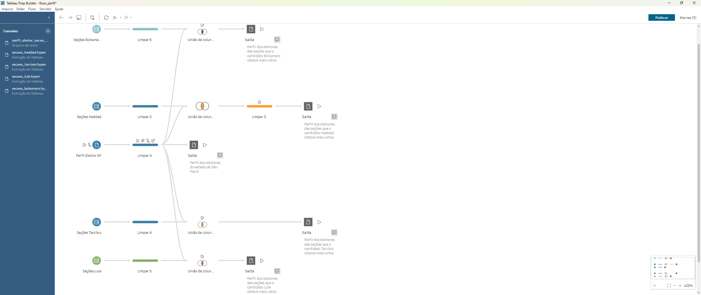

<h1>Tratamento de dados</h1>

Tratamento de dados utilizando Pyspark (Recurso Gratuito) e Tableau Prep Builder (Recurso Pago).

<ul>
    <h3>Datasets</h3>
    <li>
        <a href="https://cdn.tse.jus.br/estatistica/sead/eleicoes/eleicoes2022/buweb/bweb_2t_SP_311020221535.zip">
            Boletim da Urna Eleição 2022 - 2º Turno - São Paulo - 400MB
        </a>
    </li>
    <li>
        <a href="https://cdn.tse.jus.br/estatistica/sead/odsele/perfil_eleitor_secao/perfil_eleitor_secao_2022_SP.zip">
            Perfil Eleitorado 2022 - São Paulo - 3,3GB
        </a>
    </li>
    <li>
        Devido ao tamanho dos arquivos, os softwares de planilha como o MS Excel e LibreOffice Calc não conseguem ler os arquivos.
    </li>
</ul>

<ul>
    <h3>Objetivos</h3>
    <li>
        Importar e tratar o arquivo com o boletim da urna;
    </li>
    <li>
        Descobrir as seções que cada candidato obteve mais votos que o outro e definir como ganhador daquela seção;
    </li>
    <li>
        Importar e tratar o arquivo com o perfil do eleitores;
    </li>
    <li>
        Realizar a intersecção entre as seções que cada candidato venceu e o perfil do eleitor.
    </li>
</ul>

<h2>Tableau Prep Builder</h2>
<ul>
    <li>
        <a href="https://www.tableau.com/products/prep">
            Tableau Prep Builder
        </a>
        é uma ferramenta paga de preparação de dados da SalesForce.
    </li>
    <li>
        Consegue ler arquivos grandes. Não trava o computador mesmo que importe arquivos acima da capacidade do computador.
    </li>
</ul>

<h3>Visualização dos dados</h3>
<ul>
    <li>
        É possível visualizar os gráficos dos dados.

    </li>
    
</ul>

<h3>Importação e tratamento dados com arquivo boletim da urna</h3>
<ul>
    <li>
        Remoção das colunas não necessárias;
    </li>
    <li>
        Renomear colunas;
    </li>
    <li>
        Filtrar entre presidente e governador;
    </li>
    <li>
        Dinamizar colunas Candidatos;
    </li>
    <li>
        Definir vencedor de cada seção;
    </li>
    <li>
        Selecionar apenas as colunas [Municipio, Zona, Seção];
    </li>
    <li>
        Criar etapa de exportação.
    </li>
     
    
</ul>

<h3>Importação e tratamento dados com arquivo perfil dos eleitores</h3>
<ul>
    <li>
        Remoção das colunas não necessárias;
    </li>
    <li>
        Renomear colunas;
    </li>
    <li>
        Importar arquivos com as seções dos candidatos criados com o fluxo do boletim da urna;
    </li>
    <li>
        Realizar a união dos dois arquivos a partir das colunas [Municipio, Zona, Seção];
    </li>
    <li>
        Remoção das colunas duplicadas;
    </li>
    <li>
        Criar etapa de exportação.
    </li>
     
    
</ul>

<h2>
    Pyspark
</h2>
<ul>
    <li>
        <a href="https://spark.apache.org/docs/latest/api/python/index.html">Pyspark</a>
        é um API de Python para Apache Spark. Permite processamento de grande volume de dados, acima da capacidade possível somente com a biblioteca Pandas.
    </li>
    <li>
        Possível combinar com outros frameworks para aumentar recursos de segurança e escalabilidade.
    </li>
    <li>
        Gratuito e exige menos do computador do que o Tableau Prep Builder. Porém é necessário mais tempo e capacitação para criar o algoritmo para tratar os dados.
    </li>
    <li>
        Arquivo
        <a href="eleicoes_2022_perfil_eleitor_candidato.ipynb">
            .ipynb
        </a>
        para realizar o tratamento dos dados.
    </li>
    <li>
        Arquivo .txt com as bibliotecas requeridas. Há bibliotecas para criar gráficos, como o Plotly e o Dash.
    </li>
</ul>